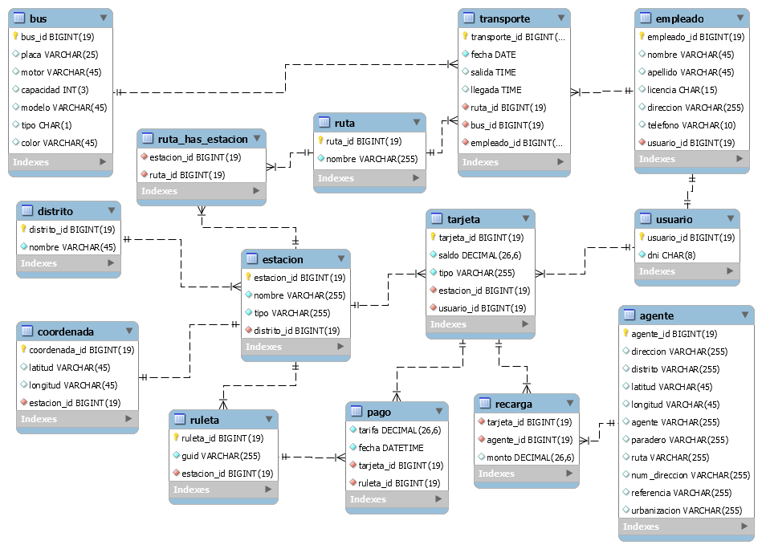
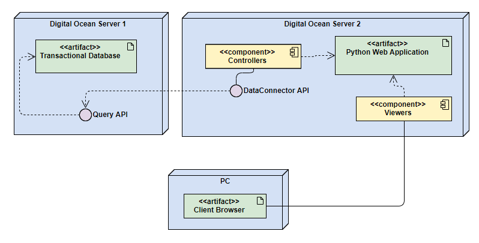
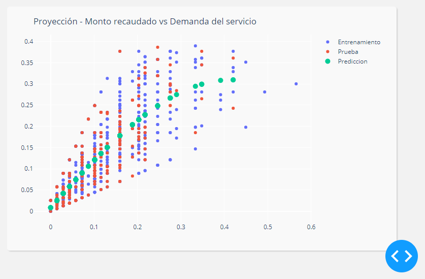

# Metropolitano

## Caso de Estudio

La manera en que se ha producido el crecimiento de la ciudad de Lima el siglo pasado ha sido estudiada en numerosos trabajos científicos. En ellos, siempre ha llamado la atención el aumento explosivo del tamaño de la población limeña —ocurrido con mayor intensidad desde mediados del siglo XX— y todo lo que ello supuso en demandas políticas y sociales y en efectos culturales. No obstante, la expansión del territorio que ocupaba la ciudad fue incluso un fenómeno mucho más espectacular que su incremento demográfico, lo que llevó, por ejemplo, a que la tasa de densidad poblacional en 1961 fuera inferior a la de 1920 [(Calderón, 2005)](#Referencias-Bibliográficas).

Este crecimiento de la urbe se orientó sobre todo a satisfacer las necesidades residenciales, tanto de sectores sociales pudientes como de aquellos de menores ingresos económicos. De esta manera, la ciudad se expandió a través de suburbios —sobre todo hacia su zona sureste— y, principalmente, para los otros, a través del fenómeno de ocupación de terrenos en zonas de desierto y de contrafuertes andinos, tanto en las periferias sur y norte de la ciudad como hacia el este, configurando un universo residencial de poblaciones conocidas como barriadas, conformando lo que Calderón ha definido como la “ciudad ilegal” [(2005)](#Referencias-Bibliográficas).

Este particular fenómeno de metrópoli, como hemos señalado, ha sido bastante estudiado en términos de las prácticas políticas y sociales que los ocupantes de estas zonas periféricas de la ciudad pusieron en marcha. Asimismo, también ha sido materia de investigaciones la manera como estos pobladores resolvían la necesidad de contar con una vivienda.

Sin embargo, al estudiar los requerimientos de esta población, también es indispensable interrogarnos sobre los otros lugares donde ellos resuelven necesidades cotidianas indispensables, como las de procurarse ingresos económicos, acceder a estudios y, en general, satisfacer las necesidades vitales de la familia, incluidos otros aspectos. Ello supone, entonces, interpelarnos acerca de **cómo se llevan a cabo las prácticas de movilidad cotidiana requeridas por las personas, es decir, por qué la gente se desplaza dentro de la ciudad y cómo resuelve esta necesidad.**

Partiendo de esta interrogante, en el estudio llevado a cabo por [(Vega Centeno, Dextre y Alegre, 2011)](#Referencias-Bibliográficas) se encontró que la historia de la formación y desarrollo del transporte público informal de la ciudad guarda estrecha relación con el tipo de expansión urbana que experimentó Lima. Por una parte, el crecimiento territorial de la ciudad trajo consigo el surgimiento de nuevas centralidades urbanas, pero la mayor parte de estas se localizan dentro del área central de la ciudad, entre el Cercado, La Victoria, San Isidro y Miraflores [(Gonzales, Del Solar y Del Pozo, 2011)](#Referencias-Bibliográficas), lo que facilita una hiperconcentración de viajes cotidianos hacia esta zona de la ciudad.

De esta manera, si bien Lima se expandió sobre la base de gran cantidad de población asentada en barrios populares conocidos como barriadas, para la gran mayoría de sus habitantes el sustento económico debía ser satisfecho en otras áreas, principalmente en la zona central de la ciudad. Es en este contexto en que hay que situar el rol que ha cumplido el transporte público informal desde mediados del siglo XX, pues con todos los defectos de calidad de servicio que le podemos conocer, este servicio se erigió como la principal y casi única respuesta a las necesidades de desplazamiento de los nuevos sectores populares de la ciudad. El transporte público cumple, así, una labor de inclusión social que, según autores como Avellaneda (2007), cuenta con algunos indicadores de eficiencia social que no deben ser soslayados.

El Metropolitano marcó un hito en la medida que supuso la mayor intervención de la Municipalidad en el funcionamiento del transporte público de la metrópoli en por lo menos medio siglo. Para ello, adoptó el sistema de corredores segregados para ómnibus de alta capacidad (COSAC), modelo inspirado en el sistema del Transmilenio de Bogotá y enmarcado en los proyectos de transporte masivo rápido en buses financiados por el Banco Mundial. En la actualidad se encuentra operativa una línea del Metropolitano, que recorre la ciudad de sur a norte desde Chorrillos hasta Independencia. A más de un año del inicio de sus funciones, es bueno observar que existen elementos favorables y otros conflictivos como resultado de esta intervención, los cuales analizaremos brevemente.

Entre los elementos positivos, destacan la mayor velocidad con que estos vehículos cubren la ruta así como la limpieza de las unidades. Esto ha sido resaltado por sus usuarios, de acuerdo con la encuesta llevada a cabo por el observatorio ciudadano [Lima Cómo Vamos (2011)](#Referencias-Bibliográficas).

Igualmente, este sistema cuenta con conductores con empleo fijo, quienes destacan por su mayor respeto hacia las normas de tránsito en comparación con los choferes de nuestro “transporte público tradicional”. A nuestro entender, esto constituye un hito importante en la transformación del sistema de transporte público, que esperamos se aplique pronto a la mayor parte de rutas que operan el servicio en la metrópoli. 

Por otra parte, la entrada en funciones del Metropolitano ha significado entre la población limeña la generación de una enorme expectativa en la modernización del sistema de transporte público en la ciudad. Los habitantes de la metrópoli, de alguna manera “adaptados” a convivir con un transporte público con conductores temerarios, vehículos en mal estado, trato deficiente y de rutas largas, de pronto experimentan que sí es posible recibir un servicio de mejor calidad. 

Finalmente, la existencia de un territorio nuevo de la movilidad, con mobiliario flamante, invita a los usuarios a desarrollar comportamientos proactivos, lo que supone un paso importante en la maduración de conductas ciudadanas. En la medida en que se ganan derechos, la población está dispuesta espontáneamente a adquirir mayores responsabilidades o compromisos con los espacios que utiliza.

### Referencias Bibliográficas

1. Calderón, J. (2005). *La ciudad ilegal: Lima en el siglo XX.* Lima: Universidad Nacional Mayor de San Marcos.
2. Gonzales de Olarte, E., Del Solar, V. & Del Pozo, J. M. (2011). *Lima metropolitana después de las reformas neoliberales: transformaciones económicas y urbanas. En Lima-Santiago. Reestructuración y cambio metropolitano.* Lima: Centro de Investigación de la Arquitectura y la Ciudad de la Pontificia Universidad Católica del Perú.
3. Avellaneda, P. (2007). *Movilidad, pobreza y exclusión social: un estudio de caso en la ciudad de Lima.* Tesis de doctorado, Universidad Autónoma de Barcelona.
4. Lima Cómo Vamos (2011). *Encuesta Lima Cómo Vamos 2011. Informe de percepción sobre calidad de vida.* Lima: Observatorio ciudadano Lima Cómo Vamos

## Modelado de Datos



## Recolección de Datos

Todos los datos detallados a continuación fueron extraídos del [Repositorio de Datos Abiertos de la Municipalidad de Lima](http://datosabiertos.munlima.gob.pe/index.php/datos).

1. [Paraderos Geo referenciados de Alimentadores Servicio Especial](../../Codigo/Datos/Paraderos_Alimentadores_Servicio_Especial.csv)
2. [Paraderos Geo referenciados de Alimentadores del Sur](../../Codigo/Datos/Paraderos_Alimentadores_Sur.csv)
3. [Paraderos Geo referenciados de Alimentadores del Norte](../../Codigo/Datos/Paraderos_Alimentadores_Norte.csv)
4. [Puntos de Recarga de Tarjetas](../../Codigo/Datos/Agentes_Recarga_Tarjeta.csv)

## Especificación de Datasets

### Paraderos Geo referenciados de Alimentadores Servicio Especial, Norte y Sur del Metropolitano

| Campo         | Descripcion               | Tipo          |
| ------------- |---------------------------| --------------|
| **Latitud**   | Coordenada                | Numérico      |
| **Longitud**  | Coordenada                | Numérico      |
| **Tipo**      | Tipo del bus              | Alfanumérico  |
| **Estacion**  | Unicación de la estación  | Alfanumérico  |
| **Ruta**      | Nombre de la ruta         | Alfanumérico  |

### Puntos de Recarga de Tarjetas del Metropolitano

| Campo                 | Descripcion                       | Tipo          |
| ----------------------|-----------------------------------| --------------|
| **Direccion**         | Ubicación geográfica exacta       | Alfanumérico  |
| **Distrito**          | Ubicación geográfica distrital    | Alfanumérico  |
| **Latitud**           | Coordenada                        | Numérico      |
| **Longitud**          | Coordenada                        | Numérico      |
| **Agente**            | Nombre del comercio               | Alfanumérico  |
| **Paradero**          | Nombre del paradero               | Alfanumérico  |
| **Ruta**              | Nombre de la ruta                 | Alfanumérico  |
| **NumDireccion**      | Numero de la direccion            | Alfanumérico  |
| **Referencia**        | Referencia geográfica del agente  | Alfanumérico  |
| **Urbanizacion**      | Nombre de la urbanizacion         | Alfanumérico  |

## Consultas Exploratorias

1. Cantidad de servicios de transporte realizados por cada día del mes

```sql
SELECT 
    DAYOFMONTH(FECHA) AS DIA, 
    COUNT(TRANSPORTE_ID) AS CANTIDAD
FROM TRANSPORTE
GROUP BY DAYOFMONTH(FECHA)
```
2. Distritos en donde mas se demanda servicios de transporte

```sql
SELECT 
    D.NOMBRE AS DISTRITO,
    COUNT(P.FECHA) AS USUARIOS
FROM PAGO P, RULETA R, ESTACION E, DISTRITO D
WHERE
    P.RULETA_ID = R.RULETA_ID AND
    R.ESTACION_ID = E.ESTACION_ID AND
    E.DISTRITO_ID = D.DISTRITO_ID
GROUP BY DISTRITO
ORDER BY USUARIOS
```
3. Rutas con mayor demanda

```sql
SELECT 
    R.NOMBRE AS RUTA,
    COUNT(T.TRANSPORTE_ID) AS SERVICIOS
FROM RUTA R, TRANSPORTE T
WHERE
    R.RUTA_ID = T.RUTA_ID
GROUP BY RUTA
ORDER BY SERVICIOS
```
4. Conductores con mas servicios hechos

```sql
SELECT 
    CONCAT(E.APELLIDO, ' ', E.NOMBRE) AS CONDUCTOR,
    COUNT(T.TRANSPORTE_ID) AS SERVICIOS
FROM EMPLEADO E, TRANSPORTE T
WHERE
    E.EMPLEADO_ID = T.EMPLEADO_ID
GROUP BY CONDUCTOR
ORDER BY SERVICIOS
```
5. Cantidad de usuarios por tipo

```sql
SELECT 
    T.TIPO AS CONDICION,
    COUNT(U.USUARIO_ID) AS USUARIOS
FROM USUARIO U, TARJETA T
WHERE
    T.USUARIO_ID = U.USUARIO_ID
GROUP BY CONDICION
ORDER BY USUARIOS
```
6. Estaciones en donde mas se adquiere tarjetas

```sql
SELECT 
    E.NOMBRE AS ESTACION,
    COUNT(T.TARJETA_ID) AS TARJETAS
FROM ESTACION E, TARJETA T
WHERE
    E.ESTACION_ID = T.ESTACION_ID
GROUP BY ESTACION
ORDER BY TARJETAS
```
7. Transacciones por estacion

```sql
SELECT 
    E.NOMBRE AS ESTACION,
    COUNT(P.FECHA) AS TRANSACCIONES
FROM ESTACION E, RULETA R, PAGO P
WHERE
    E.ESTACION_ID = R.ESTACION_ID AND
    R.RULETA_ID = P.RULETA_ID
GROUP BY ESTACION
ORDER BY TRANSACCIONES
```
8. Monto recaudado por estacion

```sql
SELECT 
    E.NOMBRE AS ESTACION,
    SUM(P.TARIFA) AS RECAUDACION
FROM ESTACION E, RULETA R, PAGO P
WHERE
    E.ESTACION_ID = R.ESTACION_ID AND
    R.RULETA_ID = P.RULETA_ID
GROUP BY ESTACION
ORDER BY RECAUDACION
```
9. Estaciones en donde mas se adquiere tarjetas agrupado por tipo

```sql
SELECT 
    E.NOMBRE AS ESTACION,
    COUNT(T.TARJETA_ID) AS TARJETAS
FROM ESTACION E, TARJETA T
WHERE
    E.ESTACION_ID = T.ESTACION_ID AND
    T.TIPO = 'universitario'
GROUP BY ESTACION
ORDER BY TARJETAS
```
10. Monto recaudado por distrito

```sql
SELECT 
    D.NOMBRE AS DISTRITO,
    SUM(P.TARIFA) AS RECAUDACION
FROM DISTRITO D, ESTACION E, RULETA R, PAGO P
WHERE
    D.DISTRITO_ID = E.DISTRITO_ID AND
    E.ESTACION_ID = R.ESTACION_ID AND
    R.RULETA_ID = P.RULETA_ID
GROUP BY DISTRITO
ORDER BY RECAUDACION
```
11. Monto recaudado por tipo de tarjeta

```sql
SELECT 
    T.TIPO AS CONDICION,
    SUM(P.TARIFA) AS RECAUDACION
FROM TARJETA T, PAGO P
WHERE
    T.TARJETA_ID = P.TARJETA_ID
GROUP BY CONDICION
ORDER BY RECAUDACION
```
11. Servicios agrupados por tipo de bus

```sql
SELECT 
    B.TIPO AS TIPO IF TIPO = 'A' THEN 'ALIMENTADOR' ELSE 'TRONCAL',
    COUNT(T.TRANSPORTE_ID) AS SERVICIOS
FROM BUS B, TRANSPORTE T
WHERE
    B.BUS_ID = T.BUS_ID
GROUP BY TIPO
ORDER BY SERVICIOS
```
12. Diferencia entre capacidad del bus y el numero de pasajeros

```sql
SELECT 
    CONCAT(T.FECHA, ' ', T.SALIDA) AS FECHA_SERVICIO,
    B.CAPACIDAD AS CAPACIDAD,
    COUNT(P.FECHA) AS PASAJEROS
FROM BUS B, TRANSPORTE T, RUTA R, RUTA_HAS_ESTACION RE, ESTACION E, RULETA RU, PAGO P
WHERE
    B.BUS_ID = T.BUS_ID AND
    T.RUTA_ID = R.RUTA_ID AND
    R.RUTA_ID = RE.RUTA_ID AND
    RE.ESTACION_ID = E.ESTACION_ID AND
    E.ESTACION_ID = RU.ESTACION_ID AND
    RU.RULETA_ID = P.RULETA_ID AND
    E.ESTACION_ID = 1
GROUP BY FECHA_SERVICIO
```
13. Agentes con mayor demanda de recargas

```sql
SELECT 
    A.AGENTE AS AGENTE,
    COUNT(R.MONTO) AS RECARGAS
FROM TARJETA T, RECARGA R, AGENTE A
WHERE
    T.TARJETA_ID = R.TARJETA_ID AND
    R.AGENTE_ID = A.AGENTE_ID 
GROUP BY AGENTE
ORDER BY RECARGAS
```
14. Monto reacudado por recargas en agentes

```sql
SELECT 
    A.AGENTE AS AGENTE,
    SUM(R.MONTO) AS MONTO
FROM TARJETA T, RECARGA R, AGENTE A
WHERE
    T.TARJETA_ID = R.TARJETA_ID AND
    R.AGENTE_ID = A.AGENTE_ID 
GROUP BY AGENTE
ORDER BY RECARGAS
```
15. Distritos con mayor demanda de recargas

```sql
SELECT 
    A.DISTRITO AS DISTRITO,
    COUNT(R.MONTO) AS RECARGAS
FROM TARJETA T, RECARGA R, AGENTE A
WHERE
    T.TARJETA_ID = R.TARJETA_ID AND
    R.AGENTE_ID = A.AGENTE_ID 
GROUP BY DISTRITO
ORDER BY RECARGAS
```
16. Estaciones frecuentes de usuarios

```sql
SELECT 
    E.NOMBRE AS ESTACION,
    COUNT(P.FECHA) AS SERVICIOS
FROM USUARIO U, TARJETA T, PAGO P, RULETA R, ESTACION E
WHERE
    U.USUARIO_ID = T.USUARIO_ID AND
    T.TARJETA_ID = P.TARJETA_ID AND
    P.RULETA_ID = R.RULETA_ID AND
    R.ESTACION_ID = E.ESTACION_ID AND
    U.USUARIO_ID = 101
GROUP BY ESTACION
ORDER BY SERVICIOS DESC
```
17. Tiempo de recorrido de los servicios

```sql
SELECT 
    T.FECHA AS FECHA,
    T.SALIDA AS SALIDA,
    T.LLEGADA AS LLEGADA,
    TIMESTAMPDIFF(HOUR, T.SALIDA, T.LLEGADA) AS DURACION
FROM TRANSPORTE T
WHERE TIMESTAMPDIFF(HOUR, T.SALIDA, T.LLEGADA) BETWEEN 1 AND 8
ORDER BY DURACION DESC
```
18. Temporadas con mayor demanda de servicios en trimestre

```sql
SELECT     
    QUARTER(T.FECHA) AS FECHA,
    COUNT(T.TRANSPORTE_ID) AS DEMANDA
FROM TRANSPORTE T
GROUP BY QUARTER(T.FECHA)
ORDER BY DEMANDA DESC
```
19. Temporadas con mayor demanda de servicios en meses

```sql
SELECT     
    MONTH(T.FECHA) AS FECHA,
    COUNT(T.TRANSPORTE_ID) AS DEMANDA
FROM TRANSPORTE T
GROUP BY MONTH(T.FECHA)
ORDER BY DEMANDA DESC
```
20. Temporadas con mayor demanda de servicios en años

```sql
SELECT     
    YEAR(T.FECHA) AS FECHA,
    COUNT(T.TRANSPORTE_ID) AS DEMANDA
FROM TRANSPORTE T
GROUP BY YEAR(T.FECHA)
ORDER BY DEMANDA DESC
```
21. Temporadas con mayor recaudacion en trimestre

```sql
SELECT     
    QUARTER(P.FECHA) AS FECHA,
    SUM(P.TARIFA) AS RECAUDACION
FROM PAGO P
GROUP BY QUARTER(P.FECHA)
ORDER BY RECAUDACION DESC
```
22. Temporadas con mayor recaudacion en meses

```sql
SELECT     
    MONTH(P.FECHA) AS FECHA,
    SUM(P.TARIFA) AS RECAUDACION
FROM PAGO P
GROUP BY MONTH(P.FECHA)
ORDER BY RECAUDACION DESC
```
23. Temporadas con mayor recaudacion en años

```sql
SELECT     
    YEAR(P.FECHA) AS FECHA,
    SUM(P.TARIFA) AS RECAUDACION
FROM PAGO P
GROUP BY YEAR(P.FECHA)
ORDER BY RECAUDACION DESC
```
24. Recaudacion por tipo de bus

```sql
SELECT     
    R.NOMBRE AS RUTA,
    SUM(P.TARIFA) AS RECAUDACION
FROM RUTA R, RUTA_HAS_ESTACION RE, ESTACION E, RULETA RU, PAGO P
WHERE 
    R.RUTA_ID = RE.RUTA_ID AND
    RE.ESTACION_ID = E.ESTACION_ID AND
    E.ESTACION_ID = RU.ESTACION_ID AND
    RU.RULETA_ID = P.RULETA_ID AND
    R.NOMBRE LIKE '%REGULAR%'
GROUP BY RUTA
ORDER BY RECAUDACION DESC
```
25. Empleado con mayor recaudacion por año

```sql
SELECT     
    CONCAT(EM.APELLIDO, ' ', EM.NOMBRE) AS EMPLEADO,
    SUM(P.TARIFA) AS RECAUDACION
FROM EMPLEADO EM, TRANSPORTE T, RUTA R, RUTA_HAS_ESTACION RE, ESTACION E, RULETA RU, PAGO P
WHERE 
    EM.EMPLEADO_ID = T.EMPLEADO_ID AND
    T.RUTA_ID = R.RUTA_ID AND
    R.RUTA_ID = RE.RUTA_ID AND
    RE.ESTACION_ID = E.ESTACION_ID AND
    E.ESTACION_ID = RU.ESTACION_ID AND
    RU.RULETA_ID = P.RULETA_ID AND
    YEAR(P.FECHA) = 2019
GROUP BY EMPLEADO
ORDER BY RECAUDACION DESC
```
26. Empleado con mayor recaudacion por año y mes

```sql
SELECT     
    CONCAT(EM.APELLIDO, ' ', EM.NOMBRE) AS EMPLEADO,
    SUM(P.TARIFA) AS RECAUDACION
FROM EMPLEADO EM, TRANSPORTE T, RUTA R, RUTA_HAS_ESTACION RE, ESTACION E, RULETA RU, PAGO P
WHERE 
    EM.EMPLEADO_ID = T.EMPLEADO_ID AND
    T.RUTA_ID = R.RUTA_ID AND
    R.RUTA_ID = RE.RUTA_ID AND
    RE.ESTACION_ID = E.ESTACION_ID AND
    E.ESTACION_ID = RU.ESTACION_ID AND
    RU.RULETA_ID = P.RULETA_ID AND
    YEAR(P.FECHA) = 2019 AND
    MONTH(P.FECHA) = 1
GROUP BY EMPLEADO
ORDER BY RECAUDACION DESC
```
## Medidas estadisticas 

```python
import numpy as np
from sklearn.preprocessing import PolynomialFeatures
from sklearn.linear_model import LinearRegression
from ..Exploracion import *
```

Datos de prueba

```python
dataset = list_principal("", "")
montoset = [float(elemento) for elemento in dataset["amount_list"]]
demandaset = [float(elemento) for elemento in dataset["demand_list"]]
recargaset = query(list_recarga)
```

Funciones de Estadistica Descriptiva

```python
def get_valor_maximo(lista):
    return max(lista)

def get_valor_minimo(lista):
    return min(lista)

def get_media_aritmetica(lista):
    return sum(lista) / len(lista)

def get_desviacion_respecto_media(lista):
    media_aritmetica = get_media_aritmetica(lista)
    return [elemento - media_aritmetica for elemento in lista]

def get_varianza(lista):
    desviacion_media = get_desviacion_respecto_media(lista)
    desviacion_media_2 = [
        elemento ** 2 for elemento in desviacion_media]
    return sum(desviacion_media_2) / len(desviacion_media_2)

def get_desviacion_tipica(lista):
    return get_varianza(lista) ** .5

def get_moda(lista):
    return max(lista, key=lista.count)

def get_mediana(lista):
    return sorted(lista)[int(len(lista) / 2)]

def get_correlacion(lista_1, lista_2):
    desviacion_lista_1 = get_desviacion_respecto_media(lista_1)
    desviacion_lista_2 = get_desviacion_respecto_media(lista_2)
    desviacion_lista_1_x_desviacion_lista_2 = [elemento_1 * elemento_2 for elemento_1,
                                               elemento_2 in zip(desviacion_lista_1, desviacion_lista_2)]
    sum_desviacion_lista_1_x_desviacion_lista_2 = sum(
        desviacion_lista_1_x_desviacion_lista_2)

desviacion_cuadrada_lista_1 = [elemento ** 2 for elemento in desviacion_lista_1]     
desviacion_cuadrada_lista_2 = [elemento ** 2 for elemento in desviacion_lista_2]
    raiz_suma_desviacion_cuadrada_lista_1 = float(
        sum(desviacion_cuadrada_lista_1)) ** 0.5
    raiz_suma_desviacion_cuadrada_lista_2 = float(
        sum(desviacion_cuadrada_lista_2)) ** 0.5

return sum_desviacion_lista_1_x_desviacion_lista_2 / (raiz_suma_desviacion_cuadrada_lista_1 * raiz_suma_desviacion_cuadrada_lista_2)


def get_covarianza(lista_1, lista_2):
    desviacion_lista_1 = get_desviacion_respecto_media(lista_1)
    desviacion_lista_2 = get_desviacion_respecto_media(lista_2)
    lista_1_x_lista_2 = [elemento_1 * elemento_2 for elemento_1,
                         elemento_2 in zip(desviacion_lista_1, desviacion_lista_2)]
    return sum(lista_1_x_lista_2) / len(lista_1_x_lista_2)


def get_cuartil(numero_cuartil, lista):
    lista = sorted(lista, key=float)
    tamaño_muestra = len(lista) if len(lista) % 2 == 0 else len(lista) + 1
    categorias = [float(element) for element in list(dict.fromkeys(lista))]
    frecuencias_absolutas = [float(lista.count(element))
                             for element in categorias]
    frecuencias_absolutas_acumuladas = [
        float(sum(frecuencias_absolutas[0: i + 1])) for i in range(0, len(frecuencias_absolutas))]
    cuartil = numero_cuartil * tamaño_muestra / 4

print("Tamaño muestra: {0}".format(tamaño_muestra))
print("Categorias: {0}".format(categorias))
print("Frecuencias absolutas: {0}".format(frecuencias_absolutas))
print("Frecuencias absolutas acumuladas: {0}".format(
frecuencias_absolutas_acumuladas))
 print("Valor de Cuartil: {0}".format(cuartil))

if cuartil in frecuencias_absolutas_acumuladas:
        return categorias[frecuencias_absolutas_acumuladas.index(cuartil)]
    else:
        posicion_categoria = [i for i in range(1, len(frecuencias_absolutas_acumuladas) - 1) if cuartil >
                              frecuencias_absolutas_acumuladas[i - 1] and cuartil < frecuencias_absolutas_acumuladas[i + 1]]
        limite_inferior = categorias[posicion_categoria[0]]
        limite_superior = categorias[posicion_categoria[0] +
                                     1] if categorias[posicion_categoria[0] + 1] else categorias[posicion_categoria[0]]
 print("Posicion: {0}".format(posicion_categoria))
print("Inferior: {0}".format(limite_inferior))
print("Superior: {0}".format(limite_superior))
        return limite_inferior + (limite_superior - limite_inferior) * ((cuartil - frecuencias_absolutas_acumuladas[posicion_categoria[0] - 1]) / (
            frecuencias_absolutas_acumuladas[posicion_categoria[0]] - frecuencias_absolutas_acumuladas[posicion_categoria[0] - 1]))
```

## Diagrama de Despliegue



## Preparacion de datos

```python
def get_valores_atipicos(X, Y):
    cuartil_1 = get_cuartil(1, Y)
    cuartil_3 = get_cuartil(3, Y)
    rango_intercuartil = cuartil_3 - cuartil_1
    limite_superior = cuartil_3 + (1.5 * rango_intercuartil)
    limite_inferior = cuartil_1 - (1.5 * rango_intercuartil)

    nuevo_X = []
    nuevo_Y = []

    for i in range(len(Y)):
        if Y[i] < limite_inferior or Y[i] > limite_superior:
            nuevo_X.append(normalizar(X, X[i]))
            nuevo_Y.append(normalizar(Y, Y[i]))

    return dict(X=nuevo_X, Y=nuevo_Y)


def get_valores_tipicos(X, Y):
    cuartil_1 = get_cuartil(1, Y)
    cuartil_3 = get_cuartil(3, Y)
    rango_intercuartil = cuartil_3 - cuartil_1
    limite_superior = cuartil_3 + (1.5 * rango_intercuartil)
    limite_inferior = cuartil_1 - (1.5 * rango_intercuartil)

    nuevo_X = []
    nuevo_Y = []

    for i in range(len(Y)):
        if Y[i] > limite_inferior and Y[i] < limite_superior:
            nuevo_X.append(normalizar(X, X[i]))
            nuevo_Y.append(normalizar(Y, Y[i]))

    return dict(X=nuevo_X, Y=nuevo_Y)


def normalizar(lista, elemento):
    valor_minimo = get_valor_minimo(lista)
    valor_maximo = get_valor_maximo(lista)
    return (elemento - valor_minimo)/(valor_maximo-valor_minimo)


def get_lista_normalizada(lista):
    valor_minimo = get_valor_minimo(lista)
    valor_maximo = get_valor_maximo(lista)
    return [(elemento - valor_minimo)/(valor_maximo-valor_minimo) for elemento in lista]


def get_lista_estandarizada(lista):
    media_aritmetica = get_media_aritmetica(lista)
    desviacion_tipica = get_desviacion_tipica(lista)
    return [(elemento - media_aritmetica)/desviacion_tipica for elemento in lista]
```

 Modelo de regresión polinómica
```python
dataset = get_valores_atipicos(demandaset, montoset)
 print(dataset)
 for i in range(len(dataset["Y"])):
     print("{0},{1}".format(dataset["X"][i], dataset["Y"][i]))

#print("Maximo: {0}".format(get_valor_maximo(montoset)))
#print("Minimo: {0}".format(get_valor_minimo(montoset)))
#print("Media aritmetica: {0}".format(get_media_aritmetica(montoset)))
#print("Desviacion media: {0}".format(get_desviacion_respecto_media(montoset)))
#print("Varianza: {0}".format(get_varianza(montoset)))
#print("Desviacion tipica: {0}".format(get_desviacion_tipica(montoset)))
#print("Moda: {0}".format(get_moda(montoset)))
#print("Mediana: {0}".format(get_mediana(montoset)))
#print("Correlacion: {0}".format(get_correlacion(montoset, demandaset)))
#print("Covarianza: {0}".format(get_covarianza(montoset, demandaset)))
#print("Primer cuartil: {0}".format(get_cuartil(1, montoset)))
#print("Tercer cuartil: {0}".format(get_cuartil(3, montoset)))
#print("Valores atipicos: {0}".format(get_valores_atipicos(montoset)))
#print("Valores tipicos: {0}".format(get_valores_tipicos(montoset)))
#print("Normalizacion: {0}".format(get_lista_normalizada(montoset)))
#print("Estandarizacion: {0}".format(get_lista_estandarizada(montoset)))
```
## Diagrama de Machine learning



### REGRESION LINEAL 

Se uso el dataset anterior ya estandarizado para poder sacar la regresion lineal 

# CARGAR LAS LIBRERIAS
```python
import matplotlib.pyplot as plt
import numpy as np
import pandas as pd
import scipy.stats #PRUEBA DE SHAPIRO-WILK
import seaborn as sns
from sklearn.model_selection import train_test_split
from sklearn.svm import SVC
from sklearn.metrics import confusion_matrix
import seaborn as sb
import matplotlib.pyplot as plt
%matplotlib inline
from mpl_toolkits.mplot3d import Axes3D
from matplotlib import cm
plt.rcParams['figure.figsize'] = (16, 9)
plt.style.use('ggplot')
from sklearn import linear_model
from sklearn.metrics import mean_squared_error, r2_score

datos= pd.read_csv('demanda_monto_tipica_normalizada.csv')
datos

#ESTADISTICAS BASICAS
print(datos.describe())
print(datos.mean(numeric_only=True))
print(datos.median())
print(datos.median(numeric_only=True))
print(datos.std(numeric_only=True))
print(datos.max(numeric_only=True))
print(datos.quantile(np.array([0,0.25,0.50,0.75,1])))

boxplots=datos.boxplot(return_type='axes')

histograma_demanda= datos[datos.columns[:1]].plot(kind='hist',color='blue')
densidad_demanda=datos[datos.columns[:1]].plot(kind='density',color='blue')

histograma_monto= datos[datos.columns[1:2]].plot(kind='hist',color='green')
densidad_monto=datos[datos.columns[1:2]].plot(kind='density',color='green')

data= datos.plot.scatter(x="demanda", y="monto", alpha=0.5)
data

corr=datos.corr()
print(corr)
sns.heatmap(datos.corr(), square=True, annot=True)

grafico = datos[(datos['demanda'] <= 3500) & (datos['monto'] <= 80000)]
 
colores=['red','blue']
tamaños=[70,60]
 
f1 = grafico['demanda'].values
f2 = grafico['monto'].values
asignar=[]
for index, row in grafico.iterrows():
    if(row['demanda']>1808):
        asignar.append(colores[0])
    else:
        asignar.append(colores[1])

    
plt.scatter(f1, f2, c=asignar, s=tamaños[0])
plt.show()

# Asignamos nuestra variable de entrada X para entrenamiento y las etiquetas Y.
dataX =grafico[["demanda"]]
X_train = np.array(dataX)
y_train = grafico['monto'].values

# Creamos el objeto de Regresión Linear
regr = linear_model.LinearRegression()

# Entrenamos nuestro modelo
regr.fit(X_train, y_train)

# Hacemos las predicciones 
y_pred = regr.predict(X_train)

print('Coeficiente:', regr.coef_)
print('termino independiente:', regr.intercept_)
print("Error cuadratico medio: %.2f" % mean_squared_error(y_train, y_pred))
print('Puntaje de varianza: %.2f' % r2_score(y_train, y_pred))

plt.scatter(x, y)
plt.plot(x, y_pred, color='blue')
x_pred = np.array([0, 100])

# Para poder graficar en 3D, haremos una variable nueva 
suma = (grafico["demanda"] + grafico['monto'])
 
dataX2 =  pd.DataFrame()
dataX2["demanda"] = grafico["demanda"]
dataX2["suma"] = suma
XY_train = np.array(dataX2)
z_train = grafico['monto'].values

regr2 = linear_model.LinearRegression()
regr2.fit(XY_train, z_train)
 
# Hacemos la predicción con la que tendremos puntos sobre el plano hallado
z_pred = regr2.predict(XY_train)
 
# Los coeficientes
print('Coefficients: \n', regr2.coef_)
# Error cuadrático medio
print("Mean squared error: %.2f" % mean_squared_error(z_train, z_pred))
# Evaluamos el puntaje de varianza (siendo 1.0 el mejor posible)
print('Variance score: %.2f' % r2_score(z_train, z_pred))

fig = plt.figure()
ax = Axes3D(fig)

# Creamos una malla, sobre la cual graficaremos el plano
xx, yy = np.meshgrid(np.linspace(0, 3500, num=10), np.linspace(0, 60, num=10))

# calculamos los valores del plano para los puntos x e y
nuevoX = (regr2.coef_[0] * xx)
nuevoY = (regr2.coef_[1] * yy) 

# calculamos los correspondientes valores para z. Debemos sumar el punto de intercepción
z = (nuevoX + nuevoY + regr2.intercept_)

# Graficamos el plano
ax.plot_surface(xx, yy, z, alpha=0.2, cmap='hot')

# Graficamos en azul los puntos en 3D
ax.scatter(XY_train[:, 0], XY_train[:, 1], z_train, c='blue',s=30)

# Graficamos en rojo, los puntos que 
ax.scatter(XY_train[:, 0], XY_train[:, 1], z_pred, c='red',s=40)

ax.view_init(elev=30., azim=65)
        
ax.set_xlabel('demanda')
ax.set_ylabel('monto')
ax.set_title('Regresión Lineal con Múltiples Variables') 
```
## Grafico 3d


